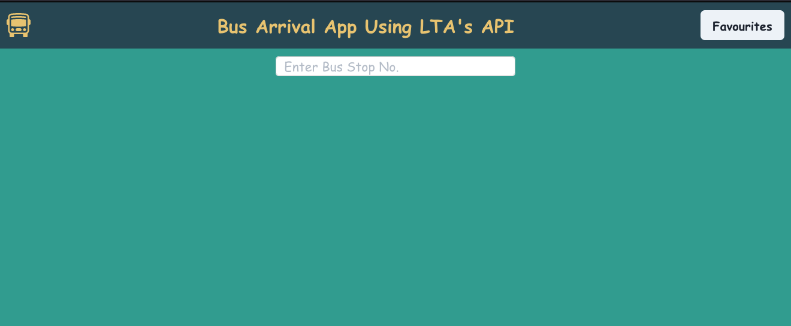
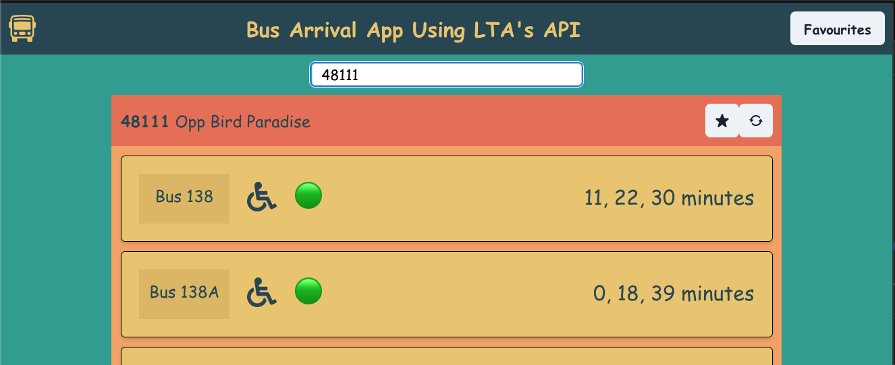
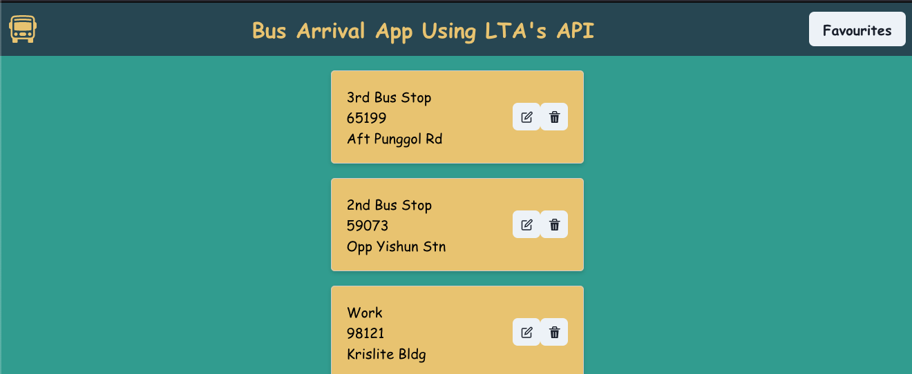

# Bus Arrival App Using LTA's API

 This React project leverages LTA's API to provide users with real-time information about bus arrivals, crowd levels, and more.

## Features

- **Bus Stop Search:** Easily find bus stops and retrieve detailed information about bus services, crowd levels, bus types, and upcoming bus timings.
- **Route Planning:** Save your favorite searches and curate a personalized route or journey for your daily commute or city exploration.
- **Real-time Updates:** Get up-to-date information straight from LTA's API, ensuring accuracy and reliability in your travel plans.

## Screenshots


*The default landing screen*


*Searching for a bus stop*


*Favourited bus stops page*

## Project Layout
```mermaid
graph TD
  A[main.jsx] --> B[App.jsx]
  B --> C[Header]
  B --> D[Homepage]
  B --> E[Favourites]
  D --> F[SearchBar]
  D --> G[BusDataContainer]
  E --> H[FavBusCard]
  G --> I[BusCard]
  ```

## Technologies Used

- React
- Chakra UI
- LTA DataMall API

## Next Steps

- Map embeds, allowing users to search for bus stops visually
- Expand search function to include long. and lat. data
- Implement user authentication for saving personalized routes.
- Improve UI/UX for a more intuitive user experience.
- Expand functionality to include additional features such as fare information and nearby attractions.
- Optimize performance for faster loading times.
- Conduct thorough testing to ensure reliability and stability.


## Contributing

We welcome contributions to this project! If you have suggestions or improvements, please fork the repository and submit a pull request.

## License

This project is licensed under the MIT License - see the [LICENSE.md](LICENSE.md) file for details.

## Acknowledgments

- Thanks to Waihon from the GA instructional team for their advice and guidance.
- Thanks to Stack Overflow for helping solve several tricky bugs.
- Thanks to ChatGPT for creating this template.
